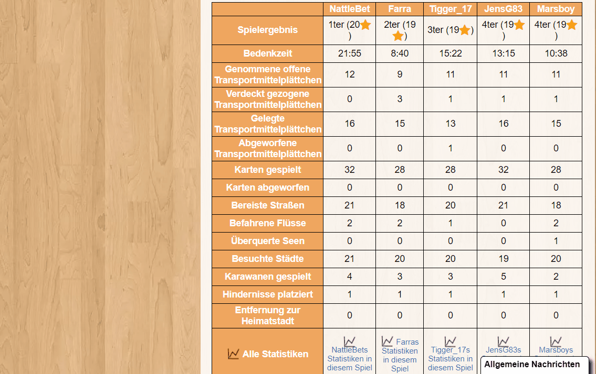

# BGA to BGG Converter
I love playing on boardgamearena.com (BGA) and I love statistics on boardgamegeek.com (BGG).

Therefore I wrote a small program which converts the BGA statistics (Premium feature) so that I can put them as a comment on BGG.

Here is a small demo:



## Configuration
### Playername Mapping
Names of players you always want to change can be stored in the following file: `classpath:defaultPlayernameMapping.properties`


Here is an example:
```
playername.mapping.NameA=Jens
playername.mapping.NameB=Laura
```

The naming convention is `playername.mapping.` followed by the BGA username you want to map.

:exclamation: The BGA username is case sensitiv.

### Default statistics
You usually want to have the same statistical values? Then you can provide the `statistic.default.enabled` configuration with comma separated statistic names. 

Example:
```
 statistic.default.enabled=Score,Time for consideration
```

:exclamation: The BGA username is case sensitiv.


### General configuration
Of course you could provide the properties over [external configuration](https://docs.spring.io/spring-boot/docs/current/reference/html/spring-boot-features.html#boot-features-external-config).